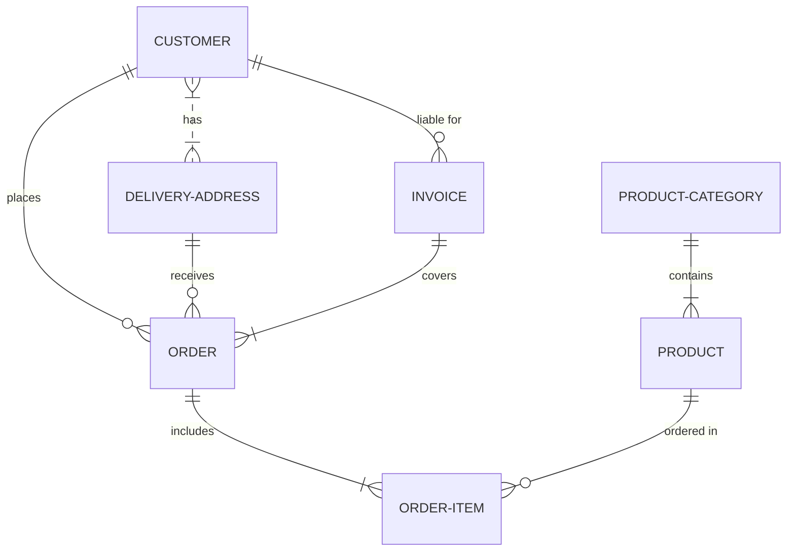

### Database Configuration Helper

A helper to ease the configuration of Entity Framework Cire database projects when using the `IEntityTypeConfiguration` pattern.

In most Enterprise Software solutions database schemas and database design patterns usually comprise of the [Star Schema](https://en.wikipedia.org/wiki/Star_schema) or [Snowflake Schema](https://en.wikipedia.org/wiki/Snowflake_schema) design patterns.

  Generally in these types of schema there are two types of table types to describe the entities:
1. fact-type tables - describe business events
2. dimension-type tables - describe business entities

