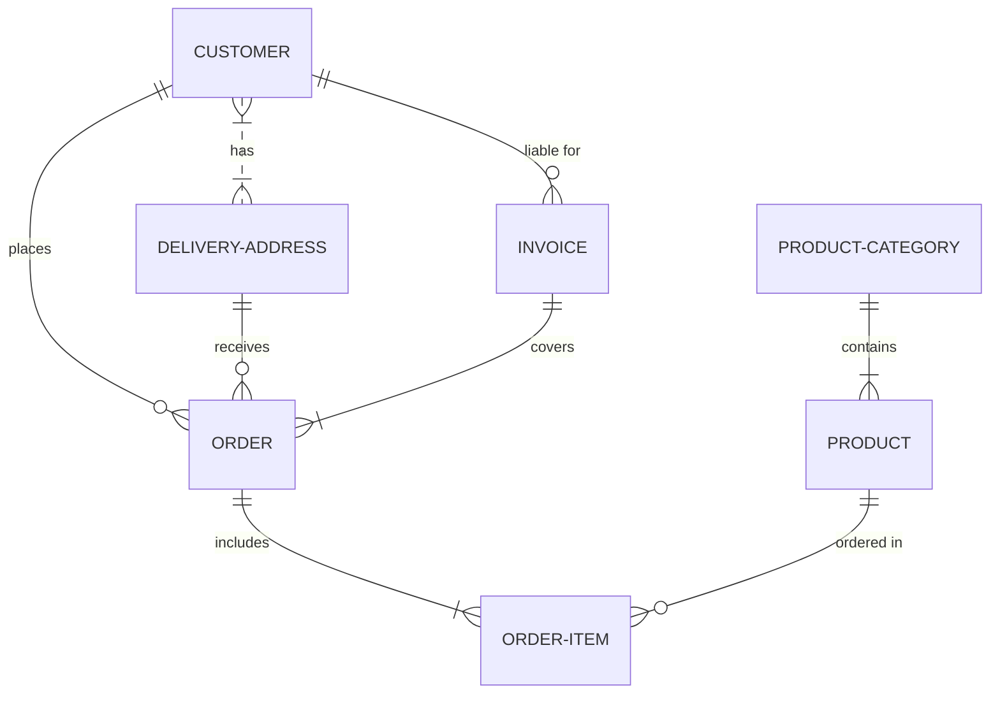

### Database configuration Helper

A helper to ease the configuration of Entity Framework Cire database projects when using the `IEntityTypeConfiguration` pattern.

In most Enterprise Software solutions database schemas and database design patterns usually comprise of the [Star Schema](https://en.wikipedia.org/wiki/Star_schema) or [Snowflake Schema](https://en.wikipedia.org/wiki/Snowflake_schema) design patterns.

   

